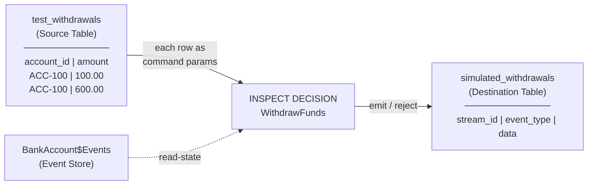
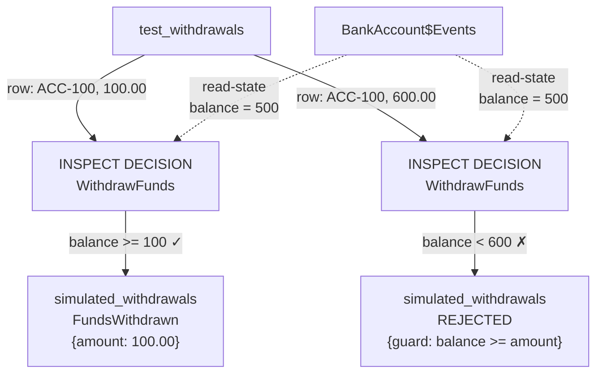

## What is INSPECT DECISION?

`INSPECT DECISION` is a dry-run mechanism that simulates a decision's evaluation against a batch of test inputs. It takes a table of command-like rows as input, runs each row through the decision's STATE AS + EMIT AS logic, and writes the results (emitted events or rejections) into a destination table — all without persisting any events to the real event store.

## Syntax

```sql
INSPECT DECISION <DecisionName>
FROM <source_table>
INTO <destination_table>;
```

## Data Flow



## Table Structures

### Source Table (Input)

The source table columns must match the command's field definitions. For `WithdrawFunds`:

```
CREATE COMMAND WithdrawFunds (
  account_id STRING,    ← column 1
  amount     DECIMAL    ← column 2
);
```

The source table is created with matching columns:

```sql
CREATE TABLE test_withdrawals AS VALUES
  ('ACC-100', 100.00),   -- row 1: withdraw 100 from ACC-100
  ('ACC-100', 600.00);   -- row 2: withdraw 600 from ACC-100
```

| account_id | amount |
|------------|--------|
| ACC-100    | 100.00 |
| ACC-100    | 600.00 |

### Destination Table (Output)

The destination table is created at runtime by the INSPECT engine. Its structure is fixed:

```sql
SELECT stream_id, event_type, data FROM simulated_withdrawals;
```

| Column | Type | Description |
|--------|------|-------------|
| `stream_id` | STRING | The aggregate instance ID (from the command's ID field) |
| `event_type` | STRING | The emitted event type name, or `'REJECTED'` if the guard failed |
| `data` | STRUCT | The event payload attributes (matches the event's field definitions) |

### Example Output

For `WithdrawFunds` with balance = 500:

| stream_id | event_type | data |
|-----------|------------|------|
| ACC-100 | FundsWithdrawn | `{amount: 100.00}` |
| ACC-100 | REJECTED | `{guard: 'balance >= :amount', balance: 500, amount: 600}` |

- Row 1: balance (500) >= amount (100) → emits `FundsWithdrawn`
- Row 2: balance (500) < amount (600) → rejected with guard details

## Detailed Flow for Guarded Decisions



## Key Properties

1. **Non-destructive** — INSPECT never writes to the real event store. The destination table is ephemeral.
2. **State-aware** — For guarded decisions (with STATE AS), INSPECT reads the real current state from `$Events`. This means results depend on what events have actually been persisted.
3. **Batch evaluation** — Each row in the source table is evaluated independently. Row 1's result does not affect row 2's state query (since no events are persisted between rows).
4. **Schema validation** — The source table columns must match the command's field definitions in order and type.

## Unconditional vs Guarded

| Decision Type | STATE AS | Guard | Behavior |
|---------------|----------|-------|----------|
| Unconditional (e.g., OpenAccount) | None | None | Every row produces an emitted event |
| Guarded (e.g., WithdrawFunds) | Queries `$Events` | WHERE clause | Rows pass or fail based on current state |

## Relationship to the Diagram

In the CQRS diagram, INSPECT DECISION connects to:
- The **Decision node** being inspected
- The **source table** (input, matches command fields)
- The **destination table** (output, contains simulated events/rejections)
- The **$Events stream** (read-only, for STATE AS queries)

The decision's existing edges (EXECUTE from command, EMIT to events) represent the live path. INSPECT provides a parallel dry-run path that bypasses event persistence.
