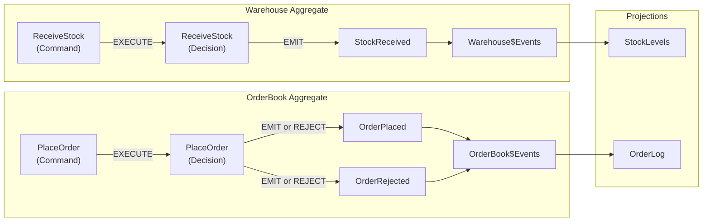

## Domain

An order fulfillment system with two aggregate boundaries: **OrderBook** (handles orders) and **Warehouse** (handles inventory). The PlaceOrder decision queries Warehouse state before emitting events — a cross-aggregate pattern.

## Runtime Behavior

## Flow

1. `ReceiveStock` command → `ReceiveStock` decision → emits `StockReceived` (unconditional) → flows into `Warehouse$Events`
2. `PlaceOrder` command → `PlaceOrder` decision → queries `Warehouse$Events` for available stock → emits `OrderPlaced` if stock sufficient, `OrderRejected` otherwise → flows into `OrderBook$Events`
3. `Warehouse$Events` feeds the `StockLevels` projection
4. `OrderBook$Events` feeds the `OrderLog` projection

## Aggregate Boundaries

Each aggregate subgraph encapsulates its full CQRS pipeline:

| Aggregate | Commands | Decisions | Events | Stream |
|-----------|----------|-----------|--------|--------|
| OrderBook | PlaceOrder | PlaceOrder | OrderPlaced, OrderRejected | OrderBook$Events |
| Warehouse | ReceiveStock | ReceiveStock | StockReceived | Warehouse$Events |

## Cross-Aggregate Query

The `PlaceOrder` decision performs a cross-aggregate state query against `Warehouse$Events` to check available stock before deciding whether to emit `OrderPlaced` or reject the command.
